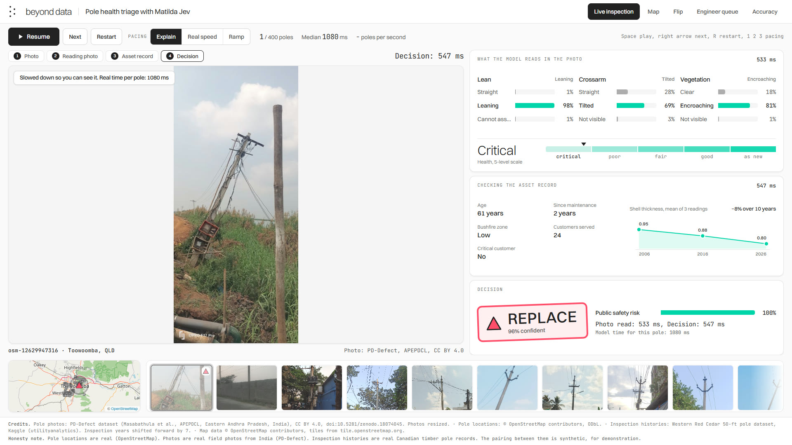

# Pole health triage with Matilda Jev

An electricity network has far more ageing poles than it can repair or replace in a year, so
someone has to decide which ones to fix first. This repo shows an open decision model
doing that triage: it looks at a photo of each pole, reads the pole's asset record, and
recommends replace, maintain, defer or reinspect, with a probability on every answer and
an engineer review queue for the cases it is unsure about.

It is a working demo, not a production system. It is built by [Beyond Data](https://beyond-data.com.au)
to show what a fast, open decision model can do on one real operational decision.

[](docs/media/pole-health-demo.mp4)

*Watch the 45 second demo ([docs/media/pole-health-demo.mp4](docs/media/pole-health-demo.mp4)): the map
filling in as 400 poles are decided, the live inspection at real speed, then the engineer queue.
Every answer in it was recorded from the model on one NVIDIA A100.*

## What it does

**Step 1: photo to findings.** A ground-level photo of a pole goes in. The model answers four
typed questions in one pass:

| Question | Options |
|---|---|
| Is the pole standing vertical? | straight, leaning, cannot assess |
| Are the crossarm and top cleat level? | straight, tilted, not visible |
| Is vegetation near the wires? | clear, encroaching, not visible |
| Overall visible condition | critical, poor, fair, good, as new |

**Step 2: findings plus record to action.** The same model gets the photo, the step 1
findings, the pole's record (age, three inspections of shell thickness and ground-line wood,
surface defects, woodpecker damage, years since maintenance, bushfire zone, customers served,
critical customers such as a hospital) and the network's maintenance policy in plain English.
It returns one action and a public safety risk probability.

**Routing.** When the chosen action's probability is below 60 percent, or the photo cannot be
assessed, the pole goes to an engineer instead of being decided automatically.

The policy is plain text inside each request, so a network can change what the model is asked to
weigh by editing that text, without retraining the model.

## The model

[Matilda Jev](https://huggingface.co/Maincode/matilda-jev-v1) is a decision model released by
Maincode, an Australian AI company, under Apache-2.0. A decision model does not write text.
You give it a state (text, JSON, and up to four images) and typed questions with the options
you define, and it returns a probability for every option from one pass through the network, without
generating any text. That is why it is fast and cheap to run, and why every answer here comes with a number you can audit.

Because the weights are open, it can run inside the network's own environment. Photos and
asset records never have to leave it.

Maincode reports a median of 56.8 ms per decision on an AMD MI355X. Our own measurements, on
an NVIDIA A100, are in the results section below.

## Results

From one recorded run on 8 October 2026: Matilda Jev v1 served by Maincode's official runtime on
one NVIDIA A100-SXM4-80GB (RunPod Secure Cloud, USD 1.59 an hour), one request at a time. The
summary is in [`runs/20261008T120934Z-http/eval_summary.json`](runs/20261008T120934Z-http/eval_summary.json).

| Task | What the model sees | Items | Accuracy | Macro F1 | ECE |
|---|---|---|---|---|---|
| Lean | Photo | 474 | 82.9% | 0.79 | 0.19 |
| Crossarm | Photo | 257 | 68.1% | 0.67 | 0.06 |
| Vegetation | Photo | 457 | 70.2% | 0.70 | 0.02 |
| Record health index (1 to 5) | Inspection record only | 500 | 69.0% | 0.62 | 0.17 |

- **Labels.** Lean, crossarm and vegetation are scored against the PD-Defect field labels, on
  balanced samples of up to 500 per task. The record task is scored against the inspector's
  Health Index on 500 of the 4,800 timber poles (100 per level). The model never sees the Health
  Index, only the measurements behind it.
- **Macro F1** averages the score for each answer option, so a model that always guessed the
  most common answer would score low even when its accuracy looked fine.
- **Calibration.** ECE (expected calibration error) is the average gap between the model's
  confidence and how often it is right, across confidence bands. Lower is better: 0.02 means
  confidence and accuracy differ by about 2 percentage points on average.
- **Speed.** Median model time, reported by the server, is 547 ms for a photo read (lean) and
  101 ms for a record-only decision. A pole in the demo takes one photo read plus one decision
  with the photo, record and policy: 1,096 ms on average over 400 poles.
- **Cost.** At USD 1.59 an hour that is 3,285 poles an hour, or USD 0.48 (AUD 0.74) per 1,000
  poles, counting GPU time only with requests back to back.
- **Routing.** Of the 400 demo poles, 130 went to the engineer queue: the model's top action was
  under 60 percent confident, or it asked for a reinspection.

## The demo

`demo/` is a static page that replays a recorded run across 1,191 real pole locations in
Toowoomba, Queensland:

- **Live inspection**: each photo, the model reading it, the findings, the record and the
  decision, slowed down so you can follow it or at the measured real speed (each decision then
  stays on screen for a short pause before the next pole). The poles per second counter is always
  the model's own speed.
- **Map**: every inspected pole turns into a replace, maintain, defer or engineer marker as it is
  decided.
- **Flip**: the same photo with two different records, and two different decisions.
- **Engineer queue**: the cases the model was not sure about, lowest confidence first.
- **Accuracy**: per-task accuracy, calibration, measured speed and cost.

The recorded demo data (`demo/data/`) is not committed, because it carries 400 field photos and
records derived from a dataset whose licence is not stated. A fresh clone shows the drawn sample
data in `demo/sample/` instead, marked as sample illustrations, until you run
`polehealth demo-data` against the model (see below). To open the page:

```bash
uv run python -m http.server 8000 -d demo    # then open http://127.0.0.1:8000/
```

`?autoplay=1&mode=real` starts the live inspection at real speed; `mode=explain` and `mode=ramp`
slow it down.

## Quickstart

Needs Python 3.11 or newer and [uv](https://docs.astral.sh/uv/).

```bash
uv sync
uv run polehealth fetch            # photos, labels, inspection records, pole locations (cached in data/raw)
uv run polehealth build-register   # data/register.json: 1,191 Toowoomba poles with histories
```

Then pick a backend for the model:

- **Your own GPU** (one card with 80 GB or more): follow `scripts/gpu/RUNBOOK.md`. It runs the
  official Maincode runtime and records speed numbers you can quote. Our recorded run kept one
  A100 rented for 42 minutes, setup included: about USD 1.11 at the listed hourly price.
- **The public Hugging Face Space** (free, slow, good for trying it): set `HF_TOKEN`, install
  the extra with `uv sync --extra space`, and use `--backend space`. Space timings include
  queueing, so they are never reported as model speed.

```bash
uv run polehealth eval --backend http --task all       # writes runs/<time>-http/
uv run polehealth demo-data --backend http --run runs/<time>-http --inspect 400   # writes demo/data/
uv run polehealth serve --backend http                  # http://127.0.0.1:8000, with "Try a photo"
```

`polehealth ask --backend http --image photo.jpg` answers one photo from the command line.

## Data, and what is real

| What | Source | Licence |
|---|---|---|
| Pole photos and labels | [PD-Defect](https://huggingface.co/datasets/EPDCL/pd-defect), field photos by APEPDCL, Andhra Pradesh, India | CC BY 4.0 |
| Pole locations | OpenStreetMap `power=pole` nodes, Toowoomba, QLD | ODbL, © OpenStreetMap contributors |
| Inspection histories | Western red cedar 50 ft pole inspections, Utility Analytics Network on Kaggle (Canada) | Not stated by the publisher; downloaded at build time, not redistributed |

The locations, photos and inspection records are all real. The pairing between them is
synthetic: no public dataset links a pole's photo to that pole's history, so each Toowoomba
location is given one photo and one Canadian inspection history, and inspection years are
shifted so the newest reads as 2026. Bushfire zone, customers served and critical customers
are synthetic too. Most labelled photos show concrete poles, while much of Australia's ageing
fleet is timber. Full details are in [DATA_SOURCES.md](DATA_SOURCES.md).

## Repo layout

```
src/polehealth/   questions, model backends, data sources, register, evaluation, demo data, local server
scripts/gpu/      setup script and runbook for a rented GPU
demo/             static demo page (sample data committed; real data generated by demo-data)
docs/media/       demo video and poster
tests/            pytest suite, no network needed
docs/spec.md      build spec and data contract
```

Run the checks with `uv run pytest -q` and `uv run ruff check .`.

## Licence

Code: Apache-2.0. Data keeps its own licence (see above). Matilda Jev is Apache-2.0 from Maincode.

Built by Beyond Data, Brisbane. We build working software on a business's own operational data to
improve one specific decision, such as which poles a network maintains this year.
